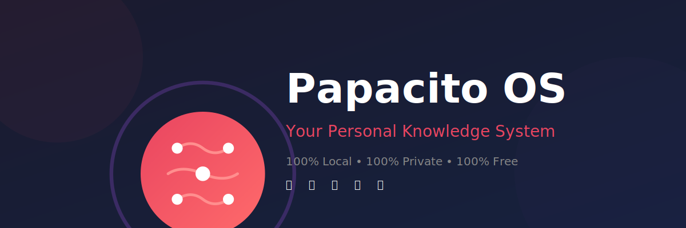

<p align="center">
  
</p>

<p align="center">
  <a href="https://opensource.org/licenses/MIT"></a>
  <a href="https://nodejs.org/"></a>
  <a href="https://nextjs.org/"></a>
  <a href="https://www.typescriptlang.org/"></a>
</p>

> **Your Personal Knowledge System - 100% Local, 100% Private, 100% Free**

Papacito OS is a multimodal second brain that captures your thoughts via **text**, **voice**, and **images** - all processed locally on your machine. No cloud, no APIs, no subscriptions.


---

## ✨ Features

### 📝 **Text Notes**
The classic way - write directly, get automatic tags.

### 🎙️ **Voice to Text** 
Record audio → [whisper.cpp](https://github.com/ggerganov/whisper.cpp) transcribes locally → Note with auto-tags

### 📸 **Image to Text**
Upload images → [Tesseract OCR](https://github.com/tesseract-ocr/tesseract) extracts text → Searchable note

### 🔍 **Smart Search**
Search across all your notes (text, transcribed audio, OCR'd images) with keyword-based ranking.

### 🏷️ **Auto-Tagging**
Notes are automatically tagged based on keywords:
- `business` - Business ideas
- `work` - Work-related
- `personal` - Personal matters
- `urgent` - Time-sensitive
- `finance` - Money matters
- `learning` - Courses, books
- `meeting` - Syncs, calls
- `idea` - New concepts

### 🔗 **Auto-Connections**
Related notes are automatically linked based on shared keywords.

### 💬 **Telegram Integration** (Optional)
Send notes from your phone via Telegram bot.

---

## 🚀 Quick Start

### Prerequisites
- macOS (Intel or Apple Silicon)
- ~100MB free space (for voice model)

### Installation

```bash
# 1. Clone the repository
git clone https://github.com/jorgefsb/papacito-os.git
cd papacito-os/my-app

# 2. Run setup (installs Node, whisper.cpp, Tesseract)
./setup-local.sh

# 3. Start the app
./start.sh

# 4. Open browser
http://localhost:3000
```

That's it! No API keys, no accounts, no cloud.

---

## 🏗️ Architecture

```
┌─────────────────────────────────────────┐
│           Next.js 14 (Frontend)         │
│     React + Tailwind + Framer Motion    │
└─────────────────────────────────────────┘
                    │
┌─────────────────────────────────────────┐
│         API Routes (Next.js)            │
│      /api/notes (CRUD + Multimedia)     │
└─────────────────────────────────────────┘
                    │
┌─────────────────────────────────────────┐
│         MULTIMEDIA LOCAL                │
│  ┌─────────────┐ ┌─────────────┐       │
│  │whisper.cpp  │ │  Tesseract  │       │
│  │(audio→text) │ │  (OCR)      │       │
│  └─────────────┘ └─────────────┘       │
└─────────────────────────────────────────┘
                    │
┌─────────────────────────────────────────┐
│     Auto-Tagging (Keywords)             │
└─────────────────────────────────────────┘
                    │
┌─────────────────────────────────────────┐
│       SQLite (better-sqlite3)           │
│   Local file: ./data/brain.db           │
└─────────────────────────────────────────┘
```

---

## 💰 Cost Comparison

| Service | Monthly Cost |
|---------|-------------|
| Notion/Obsidian | $8-15 |
| Otter.ai (transcription) | $10 |
| OpenAI Whisper API | $20-50 |
| OCR APIs | $5 |
| **Papacito OS** | **$0** |

**Annual savings: $500-900 USD**

---

## 🛠️ Tech Stack

| Layer | Technology |
|-------|-----------|
| Frontend | Next.js 14, React, TypeScript |
| Styling | Tailwind CSS, shadcn/ui |
| Audio → Text | whisper.cpp (local) |
| Image → Text | Tesseract OCR (local) |
| Database | SQLite (better-sqlite3) |
| Search | Keyword-based ranking |
| Animations | Framer Motion |

---

## 📁 Project Structure

```
papacito-os/
├── my-app/                 # Next.js application
│   ├── app/               # App router
│   ├── components/        # React components
│   ├── lib/              # Utilities
│   │   ├── ai/           # AI/multimedia processing
│   │   ├── db/           # Database
│   │   └── telegram/     # Telegram bot
│   ├── public/           # Static assets
│   ├── whisper-cpp       # Local whisper binary
│   ├── setup-local.sh    # Setup script
│   └── start.sh          # Start script
├── assets/               # Icons and branding
├── docs/                 # Documentation
└── README.md
```

---

## 🎯 Use Cases

### 1. Brain Dump in the Car
Record voice notes while driving → Automatic transcription → Tagged and searchable

### 2. Whiteboard Capture
Photo of whiteboard after meeting → OCR extracts text → Digital notes

### 3. Quick Ideas
Type ideas as they come → Auto-tagged by topic → Connected to related notes

### 4. Document Digitization
Screenshot/photo of important documents → OCR → Searchable archive

### 5. Meeting Notes
Record entire meeting → Transcribed automatically → Review and edit later

---

## 🔧 Configuration

### Telegram Bot (Optional)

1. Create bot with [@BotFather](https://t.me/botfather)
2. Copy token
3. Add to `.env.local`:

```bash
TELEGRAM_BOT_TOKEN=your_token_here
TELEGRAM_CHAT_ID=your_chat_id
```

---

## 🤝 Contributing

We welcome contributions! Here's how:

1. **Fork** the repository
2. **Create** a feature branch: `git checkout -b feature/amazing-feature`
3. **Commit** your changes: `git commit -m 'Add amazing feature'`
4. **Push** to the branch: `git push origin feature/amazing-feature`
5. **Open** a Pull Request

### Areas for Contribution

- [ ] Visual graph of note connections
- [ ] Export to Markdown/PDF
- [ ] Mobile app (React Native?)
- [ ] More languages for OCR
- [ ] Plugin system
- [ ] Themes
- [ ] Keyboard shortcuts
- [ ] API for integrations

---

## 📝 License

MIT License - see [LICENSE](LICENSE) file

---

## 🙏 Credits

- [whisper.cpp](https://github.com/ggerganov/whisper.cpp) by Georgi Gerganov
- [Tesseract OCR](https://github.com/tesseract-ocr/tesseract) by Google
- [Next.js](https://nextjs.org/) by Vercel
- [shadcn/ui](https://ui.shadcn.com/) components

---

## 🦖 About

Created with ❤️ for the open source community.

Powered by AI + Human collaboration 🤖💙👤

*"Speak, photograph, write. Your second brain is alive."*

---

## 📸 Screenshots


*Dashboard with stats and recent notes*


*Note editor with auto-tagging*


*Search across all your knowledge*

---

## 🚀 Roadmap

- [x] Text notes
- [x] Voice transcription (whisper.cpp)
- [x] Image OCR (Tesseract)
- [x] Auto-tagging
- [x] Search
- [ ] Visual graph
- [ ] Mobile app
- [ ] Cloud sync (optional)
- [ ] Collaborative features
- [ ] AI-powered insights (local)

---

**Star ⭐ this repo if you find it useful!**